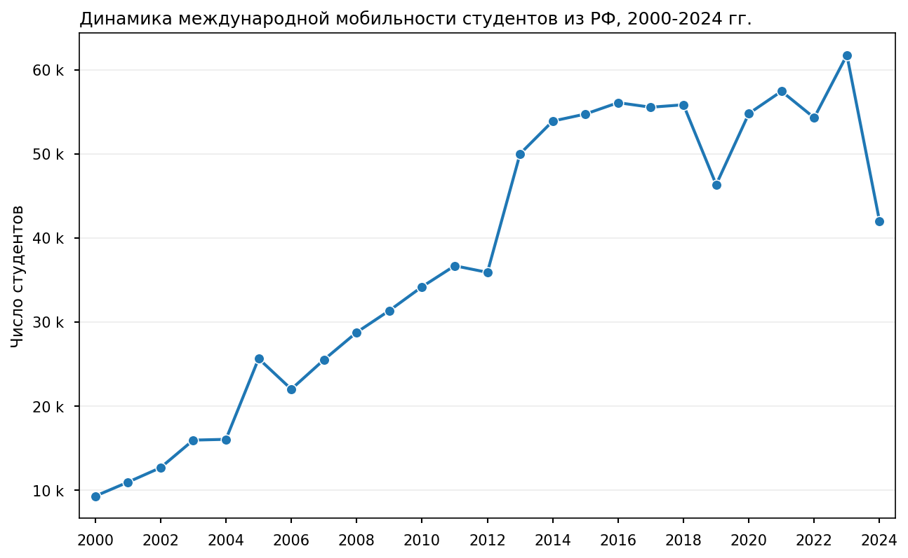
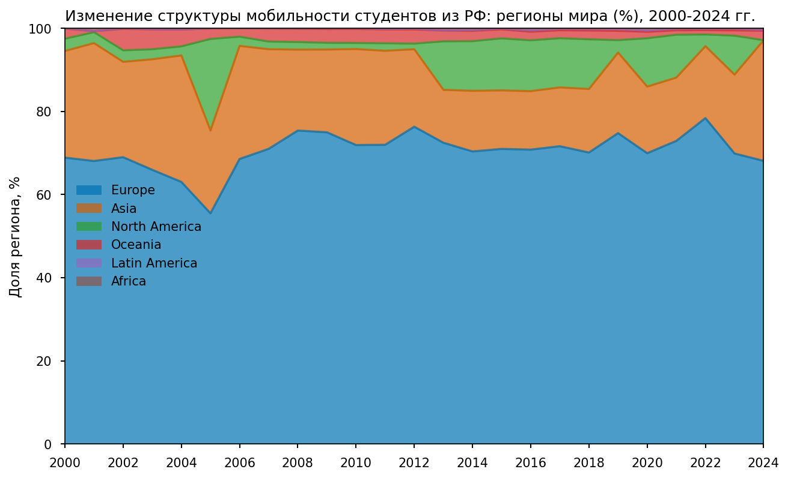
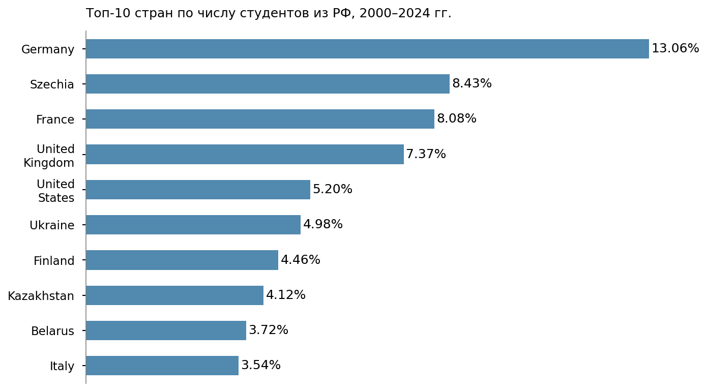
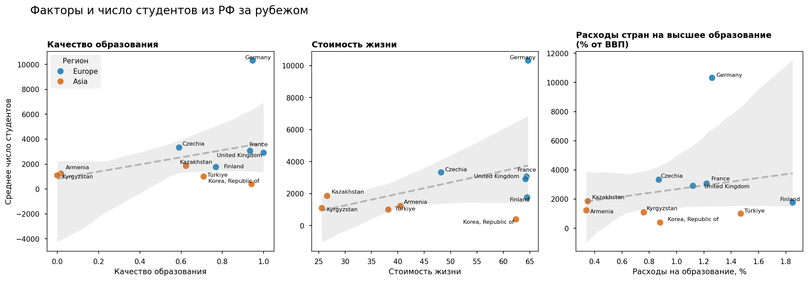
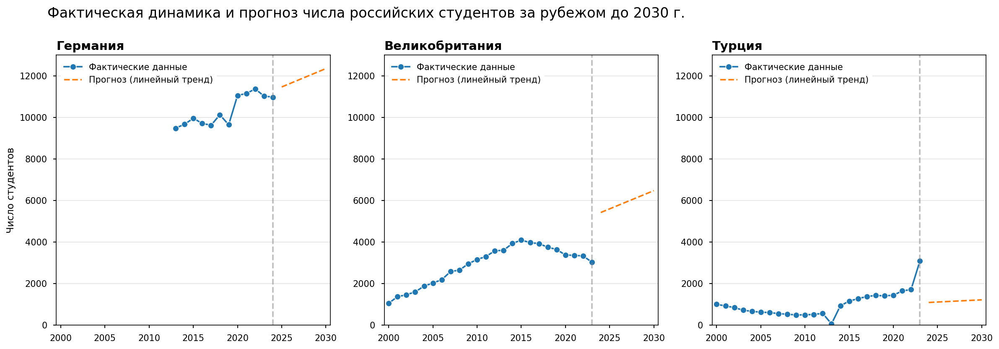

# Анализ международной мобильности российских студентов (2000–2024)

## О проекте
В проекте на Python и SQL исследована динамика и структура международной мобильности российских студентов в 2000-2024 гг. Анализ может служить основой для оценки устойчивости образовательных потоков, выявления приоритетных стран и регионов и поддержки решений в области международного образовательного сотрудничества. 

Анализ показал, что международная мобильность российских студентов характеризуется устойчивой региональной структурой с доминированием стран Европы, несмотря на ускоренный рост отдельных азиатских направлений. 

## Структура
dashboard/ – дашборд   
data/ – данные  
python/ – анализ на Python      
sql/ – SQL-запросы    
visuals/ – графики   
international_student_mobility_from_Russia.pdf/ – аналитическая записка

## Методология
- разведочный анализ данных (EDA)  
- расчет показателей роста мобильности (CAGR)  
- анализ концентрации (HHI, CR5, CR10)  
- оценка устойчивости потоков (CV)  
- анализ динамики и структуры
- корреляция Спирмена
- линейная регрессия  

## Инструменты
- Python (pandas, matplotlib, seaborn, scipy, scikit-learn, country_converter) 
- SQL (PostgreSQL, агрегаты, подзапросы, JOIN, CTE, CASE, оконные функции) 
- Yandex DataLens 
- JupyterLab, DBeaver

## Ключевые результаты и рекомендации
- Общее число студентов за рубежом увеличилось в **4,5 раза**, достигнув почти 42 000 человек в 2024 г. (оценка может быть занижена из-за неполноты данных по странам)

- **Европа доминирует** в структуре мобильности (71%, CAGR=6,4%), Азия занимает второе место (19%, CAGR=7%) и показывает наиболее высокие темпы роста

- Мобильность характеризуется **умеренной концентрацией**: **CR5=42%**, **CR10=63%**, **HHI=0,053**  
  Тенденция к росту концентрации: за 25 лет **HHI вырос на 34%**

- **Германия** – крупнейшее (**13%**) и наиболее стабильное направление среди ведущих стран Европы и Азии (**CV=0,07**)

- Наименее стабильные направления среди ведущих стран Европы и Азии - Чехия, Киргизия, Турция, Республика Корея

- Страны с наиболее высокими темпами роста за весь период (2000-2024 гг.) – Чехия, Италия, Армения и Республика Корея

- Лидеры роста во второй половине периода (2013-2024 гг.) – Турция, Словакия, Сербия, Словения, Венгрия, Узбекистан и Республика Корея

- Качество образования, стоимость жизни и государственные расходы на высшее образование не объясняют различия в распределении российских студентов между странами

  
- При сохранении текущих тенденций возможен умеренный рост потока студентов в Германию в ближайшие годы (177 человек в год согласно линейной модели). Однако модель экстраполирует текущий тренд на ближайшие годы и не учитывает влияние внешних факторов.

**Рекомендации учреждениям высшего образования:**

1.	Анализ показал, что диверсификация направлений остается ограниченной. Рекомендуется развивать образовательные связи со странами Азии, Африки и Латинской Америки. 
2.	Расширять сотрудничество с региональными образовательными центрами и растущими направлениями (Турция, Республика Корея, страны Центральной Азии).
3.	Применяя метрики CAGR и CV, проводить мониторинг наиболее активно растущих направлений. При планировании международных образовательных программ оценивать стабильность потоков и возможные риски.
4.	В рамках факторного анализа мобильности учитывать геополитические риски, санкции, визовую политику, стоимость обучения и наличие стипендиальных программ.

Результаты могут быть использованы университетами для развития международного сотрудничества, государственными органами при формировании образовательной политики и исследовательскими центрами для анализа международной академической мобильности.

**Полный отчет о проекте (аналитическая записка)**: [international_student_mobility_from_Russia.pdf](international_student_mobility_from_Russia.pdf)
